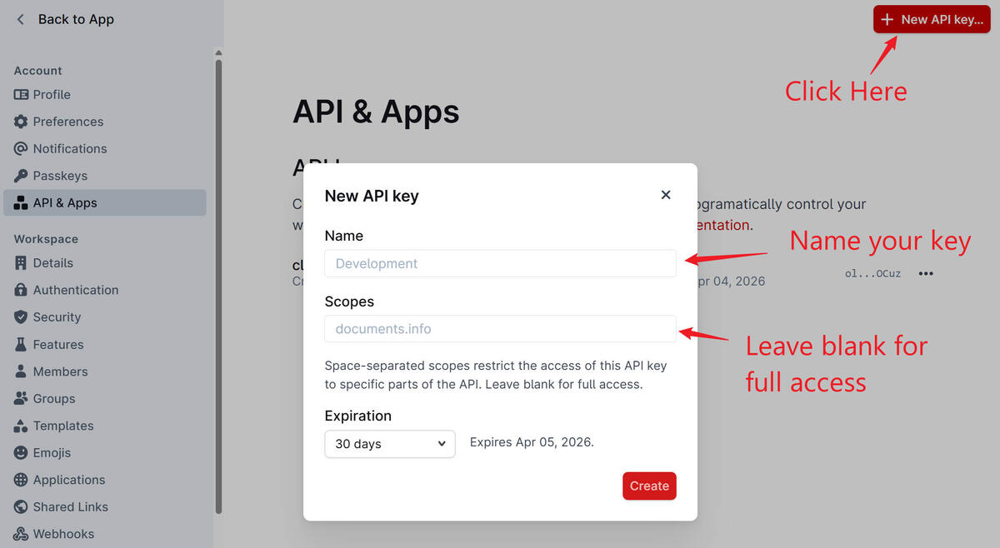

# Outline Skills

AI agent skill for interacting with [Outline](https://www.getoutline.com/) knowledge bases. Enables your AI assistant to manage documents, collections, search content, and handle team collaboration workflows.

## Features

- Full Outline API coverage: documents, collections, search, users, groups, comments, attachments, shares, stars, revisions, events, views, and file operations
- Membership and permission workflows for documents, collections, and groups
- Markdown comment creation with rich-text rendering and automatic long-reply splitting for Outline comments
- Works with Claude Code, Codex, Cursor, Windsurf, and other AI agents
- Cross-platform: Windows, Linux, and macOS

## Installation

### Claude Code

```bash
/plugin marketplace add visualdust/outline-skills
/plugin install outline-skills
```

### Other AI Agents

Using [vercel-labs/skills](https://skills.sh/):
```bash
npx skills add visualdust/outline-skills -a codex    # Codex
npx skills add visualdust/outline-skills -a cursor   # Cursor
npx skills add visualdust/outline-skills -a windsurf # Windsurf
```

### Prerequisites

Install the CLI tool (required by the skill):
```bash
pip install outline-kb-cli
```

## Quick Start

### 1. Get Your API Key

Create an API key in your Outline workspace settings:



### 2. Configure Authentication

Set environment variables:

```bash
export OUTLINE_API_KEY="ol_api_xxxxxxxxxxxxxxxxxxxxxxxxxxxxxxxxxxxxxx"
export OUTLINE_BASE_URL="https://app.getoutline.com/api"  # Must include /api suffix
```

Or create `.outline-skills/config.json`:

```json
{
  "api_key": "ol_api_xxxxxxxxxxxxxxxxxxxxxxxxxxxxxxxxxxxxxx",
  "base_url": "https://app.getoutline.com/api"
}
```

### 3. Use with Your AI Agent

Once installed, your AI agent can interact with Outline:

```text
Search Outline for onboarding documentation
Create a new document in the Engineering collection
List all collections in my workspace
Add a comment to the API documentation
```

The agent will automatically use the configured credentials to perform these operations.

## Documentation

- [skills/outline-skills/SKILL.md](skills/outline-skills/SKILL.md) - Complete command reference and usage guide
- [AGENTS.md](AGENTS.md) - Root agent instructions

## Standalone CLI Usage

While this repo is designed for AI agent integration, the underlying `outline-kb-cli` package can also be used as a standalone CLI tool. See [skills/outline-skills/SKILL.md](skills/outline-skills/SKILL.md) for detailed command reference.

## Development

### Project Structure

```text
outline-skills/
├── outline_cli/             # Python CLI package
│   ├── cli.py               # CLI implementation
│   ├── client.py            # Outline API client
│   └── config.py            # Configuration loading
├── skills/outline-skills/   # Agent skill documentation
├── .claude-plugin/          # Plugin manifest
│   ├── plugin.json
│   └── marketplace.json
├── tests/                   # Test suite
└── docs/                    # Documentation assets
```

### Testing

```bash
python -m ruff check .
python -m mypy outline_cli
python -m pytest
```

## Security Note

Keep your Outline API key secure:
- Never commit API keys to version control
- Use environment variables or gitignored config files
- Rotate keys regularly if exposed

## License

MIT License - see [LICENSE](LICENSE).
