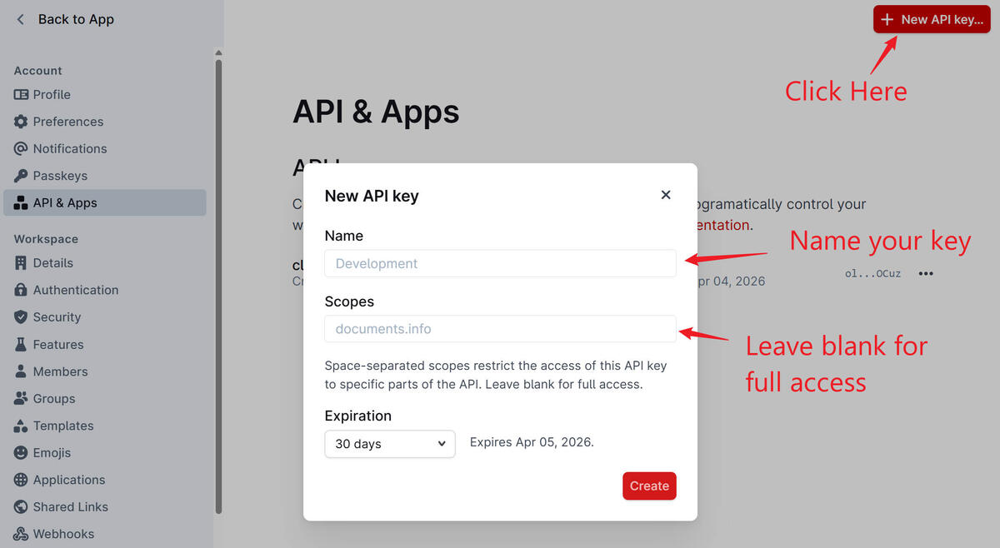

# Outline Skills

AI agent skill for interacting with [Outline](https://www.getoutline.com/) knowledge bases. Enables your AI assistant to manage documents, collections, search content, and handle team collaboration workflows.

## Features

- Full Outline API coverage: documents, collections, search, users, groups, comments, attachments, shares, stars, revisions, events, views, and file operations
- Membership and permission workflows for documents, collections, and groups
- High-level local Markdown publishing that uploads local image assets, rewrites links, and rolls back temporary Outline resources on failure
- Markdown comment creation with rich-text rendering and automatic long-reply splitting for Outline comments
- Works with Claude Code, Codex, Cursor, Windsurf, and other AI agents
- Cross-platform: Windows, Linux, and macOS

## Installation

### Claude Code

```bash
/plugin marketplace add visualdust/outline-skills
/plugin install outline-skills
```

### Other AI Agents

Using [vercel-labs/skills](https://skills.sh/):
```bash
npx skills add visualdust/outline-skills -a codex    # Codex
npx skills add visualdust/outline-skills -a cursor   # Cursor
npx skills add visualdust/outline-skills -a windsurf # Windsurf
```

### Prerequisites

Install the CLI tool (required by the skill):
```bash
pip install outline-kb-cli
```

## Quick Start

### 1. Get Your API Key

Create an API key in your Outline workspace settings:



### 2. Configure Authentication

Set environment variables:

```bash
export OUTLINE_API_KEY="ol_api_xxxxxxxxxxxxxxxxxxxxxxxxxxxxxxxxxxxxxx"
export OUTLINE_BASE_URL="https://app.getoutline.com/api"  # Must include /api suffix
```

Or create `~/.outline-skills/config.json`:

```json
{
  "api_key": "ol_api_xxxxxxxxxxxxxxxxxxxxxxxxxxxxxxxxxxxxxx",
  "base_url": "https://app.getoutline.com/api"
}
```

### 3. Use with Your AI Agent

Once installed, your AI agent can interact with Outline:

```text
Search Outline for onboarding documentation
Create a new document in the Engineering collection
List all collections in my workspace
Add a comment to the API documentation
```

The agent will automatically use the configured credentials to perform these operations.

## Documentation

- [skills/outline-skills/SKILL.md](skills/outline-skills/SKILL.md) - Complete command reference and usage guide
- [AGENTS.md](AGENTS.md) - Root agent instructions

## Standalone CLI Usage

While this repo is designed for AI agent integration, the underlying `outline-kb-cli` package can also be used as a standalone CLI tool. See [skills/outline-skills/SKILL.md](skills/outline-skills/SKILL.md) for detailed command reference.

By default, commands print compact, agent-friendly JSON summaries instead of the full Outline API response. These summaries keep the most useful IDs, names, URLs, counts, pagination, and bounded text previews while omitting noisy policy/token/nested fields. Use `--raw` when you need the complete API JSON, and `--max-text-chars` to tune preview length in summary mode:

```bash
# Compact summary output, suitable for agents and shell inspection.
outline-cli auth info
outline-cli search "deployment guide" --limit 5

# Complete Outline API response for debugging or custom scripts.
outline-cli auth info --raw

# Keep document metadata but suppress text bodies in the summary.
outline-cli documents info --id "doc-id" --max-text-chars 0
```

API failures are written to stderr with contextual fields such as HTTP status, endpoint, URL, message, and an actionable hint for common cases (`401`, `403`, `404`, `429`, and server errors). Invalid config-file warnings are also written to stderr so JSON stdout remains machine-readable.

For longer document/comment bodies, prefer file-backed inputs instead of large shell arguments:

```bash
outline-cli documents create --title "Title" --collection-id "coll-id" --text-file ./doc.md
outline-cli documents update --id "doc-id" --text-file ./doc.md
outline-cli comments create --document-id "doc-id" --data-file ./comment.md
outline-cli comments update --id "comment-id" --data-file ./comment.md
```

### Publishing local Markdown with images

Use `documents create-from-file` when a local Markdown file contains relative image links such as ``.
The workflow preflights all local assets before creating anything in Outline, creates a temporary unpublished document for attachment upload, uploads each unique asset once, rewrites the Markdown to Outline attachment URLs, and then publishes/updates the final document. If an API/upload step fails mid-flight, the CLI attempts to delete uploaded attachments and the temporary document, and the error message includes the cleanup outcome.

```bash
# First validate what would be uploaded without touching Outline.
outline-cli documents create-from-file \
  --file ./report.md \
  --collection-id "collection-id" \
  --dry-run

# Publish the document and rewrite local image URLs to Outline attachment URLs.
outline-cli documents create-from-file \
  --file ./report.md \
  --collection-id "collection-id" \
  --title "Experiment Report" \
  --save-rewritten ./report.outline.md
```

Supported local references include inline Markdown images, reference-style Markdown images, and HTML `` tags outside fenced/indented code blocks. Remote URLs, `data:` URLs, and anchors are left unchanged. By default, local assets must stay under the Markdown file's directory; use `--asset-root` to narrow that boundary, or `--allow-outside-assets` only when you intentionally want to upload files outside it. Add `--upload-local-links` to upload local non-image links such as PDFs.

For a single existing Outline document attachment, use:

```bash
outline-cli attachments upload --document-id "document-id" --file ./figure.png
```

## Development

### Project Structure

```text
outline-skills/
├── outline_cli/             # Python CLI package
│   ├── cli.py               # CLI implementation
│   ├── client.py            # Outline API client
│   ├── local_markdown.py    # Local Markdown asset preflight/rewrite workflow
│   └── config.py            # Configuration loading
├── skills/outline-skills/   # Agent skill documentation
├── .claude-plugin/          # Plugin manifest
│   ├── plugin.json
│   └── marketplace.json
├── tests/                   # Test suite
└── docs/                    # Documentation assets
```

### Testing

```bash
uv run --extra dev python -m ruff check outline_cli tests
uv run --extra dev python -m mypy outline_cli
uv run --extra dev python -m pytest -q
```

## Security Note

Keep your Outline API key secure:
- Never commit API keys to version control
- Use environment variables or gitignored config files
- Rotate keys regularly if exposed

## License

MIT License - see [LICENSE](LICENSE).
